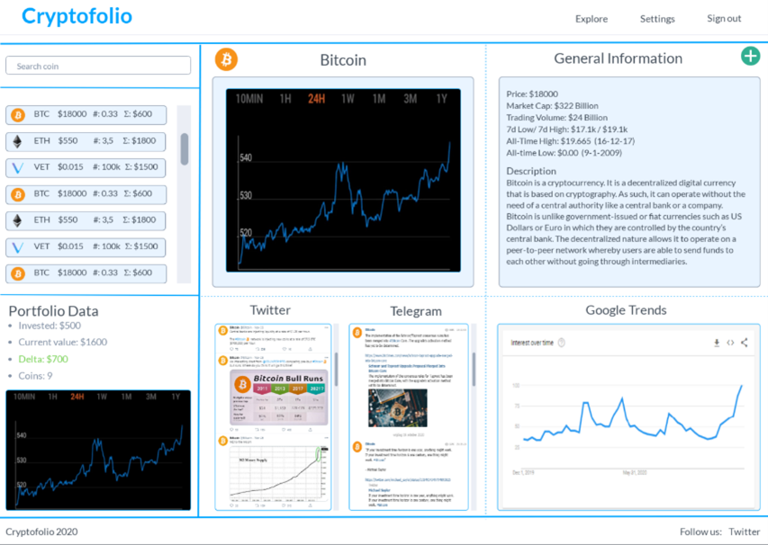
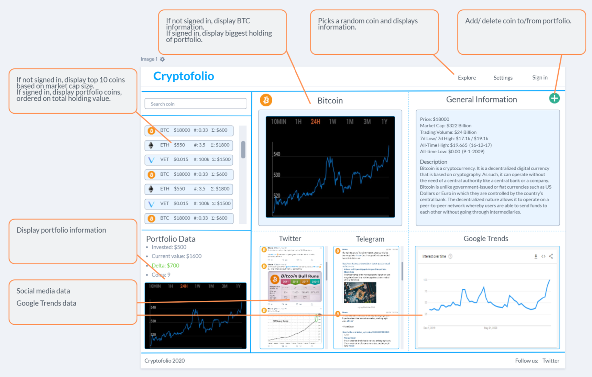

# Design Document
The website is build as a Single Page Website by combining Python, HTML, CSS and Javascript with the CSS framework Bootstrap and the python-based web framework Django.
- The layout of the website is build with HTML and CSS.
- The information on the pages is a combination of Python (server side) and Javascript (client side).
- User data is stored with Python and Django; Portfolio data, Trade data and Settings.
- Cryptocurrency data is fetched with Javascript from CoinGecko, a cryptocurrency data aggregation website, via an API.

## Website
 

## Website images with notes
 

 

### Element explanation by number
1. Top 7 trending coins in the past 24 hours. Clickable if you hover over the name (see 1b).
2. Historical price graph of the by the user selected cryptocurrency. Timeframes: 1 day, 3 days, 7 days, 30 days, 365 days and max available timeframe. If user hovers over the chart, price and time details pop-up at pointer position.
3. General information about the by the user selected cryptocurrency.
4. User's portfolio info: coins, amount, current value of coin and total value of coin holding. Coin name is clickable if user hovers over name. Will display coin page if clicked.
5. General user portfolio info; total value, initial investment, current return on investment (green: profit / red: loss), nr of coins in portfolio, nr of trades executed.
6. Twitter timeline of the by the user selected cryptocurrency.
7. Note field for the user to write down a note about the selected cryptocurrency; e.g. reason of investment.
8. Historical portfolio value chart. Timeframes: 1 day, 3 days, 7 days, 30 days and 365 days.
9. Overview of executed trades with a button to delete a trade. (Green: buy trade / red: sell trade)
10. Mention and clickable link of CoinGecko for providing data at no cost as a thank you.

### Special website elements
  

11. Explore button; picks a coin from all available coins and displays data. 
12. Opens settings screen
13. Logs out user
14. Field to search for a coin. When user types one or more characters, website displays all available coins with the substring in the name of the coin at the location of the 'Trending coins overview'. It's possible to click a coin in the list or use the 'search button'. Displays feedback if user uses 'searh button' and coin info is not available.

   

15. Button to save prefered language of the user; will show coin descriptions in prefered language if available.
16. Button which displays a screen with information about the top trending coins in a specific format to post it in a thread on Twitter (more at 19-20).
17. Creates a link to download the user's trade history in a CSV format. Downloads CSV file if user clicks on link.

  
  

18. Example of a coin description whereby the user chose Korean as language preference. 
19. Example of a generated twitter thread; Tweet with coins overview and a seperate tweet for each coin.
20. Example of how a part of the thread is displayed on Twitter.

 

21. Pop-up screen when user clicks 'add trade': (green: buy / red: sell). Current price and coin name is pre-filled but editable by user. When trade added it also automatically adds coin to portfolio if coin was not in portfolio already.
22. Button to add coin to portfolio. Displays 'remove' if already in portfolio.

    

23. Field to write a note about the coin. 'Delete Note' button gets displayed when user wrote a note already.
24. Confirmation pop-up shows up if user clicks 'Delete Note' button.

  

25. Confirmation pop-up shows up if user clicks 'Delete Trade' button.

    

26. Login pop-up field. 'login button' disabled until user enters password. Displays error message if invalid email/ password input.
27. Register pop-up field. 'Register button' disabled until user enters passwords. Displays error if user already exists.

   

28. Website if no user is signed in. Displays 'login button'.  Disabled 'add trade', 'add to portfolio' and 'add note' buttons. Hides portfolio info field.
29. Website if new user signs in. Hides portfolio graph until trades are added. Displays empty 'Portfolio Holdings' and 'Trade history' field.

 

30. Displays 'No description available' if no description available. Price history graph of one of the best cryptocurrency scams and a note if you got interested in cryptocurrencies. ;)

# Design Document Plan
## Main Features for MVP ('+' = Optional)
- User accounts; Sign in and register option for users.
- Search and add cryptocurrencies to a portfolio.
- Delete cryptocurrencies from portfolio.
- For each coin in portfolio: display number of coins user holds and total value of the holding.
- Display trade history.
- Display general portfolio information; total value, invested amount, profit/loss, number of different coins.
- +Display historical graph of portfolio.

.

- Display general coin information; price, market cap, trading volume and description.
- Display latest social media updates; Twitter.
- Display Google trends results.
- Write a comment for yourself at a coinpage; e.g. reason you bought.
- +Display community chat; Telegram
- +Display coin price graph.

.

- +Explorer option: get information about  a random coin.
- +Settings option: language and base currency.
- +Export data option: Export trade data to a CSV file.

## User interface
### General overview

### UI explanation

### Login and register screen

### Add and edit coins to portfolio

## Database

## Lists
### API's
- Cryptocurrency data; API
Need data to display real-time price and description.
https://www.coingecko.com/api/documentations/v3#/simple/get_simple_price 
- Twitter account data; API
Account data of specific coins to display latest coin updates.
https://developer.twitter.com/en/docs/twitter-api/users/lookup/introduction 
- Telegram channel; API
Channel data to display latest messages of the community.
https://core.telegram.org/widgets/post 
- Google trends search data; Embedded script
Data to show Google Trends graph of the specific coin.
https://trends.google.com/trends/explore?q={coin}&geo=US 

### External source for cryptocurrency data; API
Request URL:
https://api.coingecko.com/api/v3/coins/bitcoin?tickers=true&market_data=true&community_data=true&developer_data=true&sparkline=true
- Coin ticker ($BTC, $ETH)
- Coin name
- Coin price
- Coin description
- Coin image

### External components
- Bootstrap; layout functionaliteit voor dynamische indeling van de website

